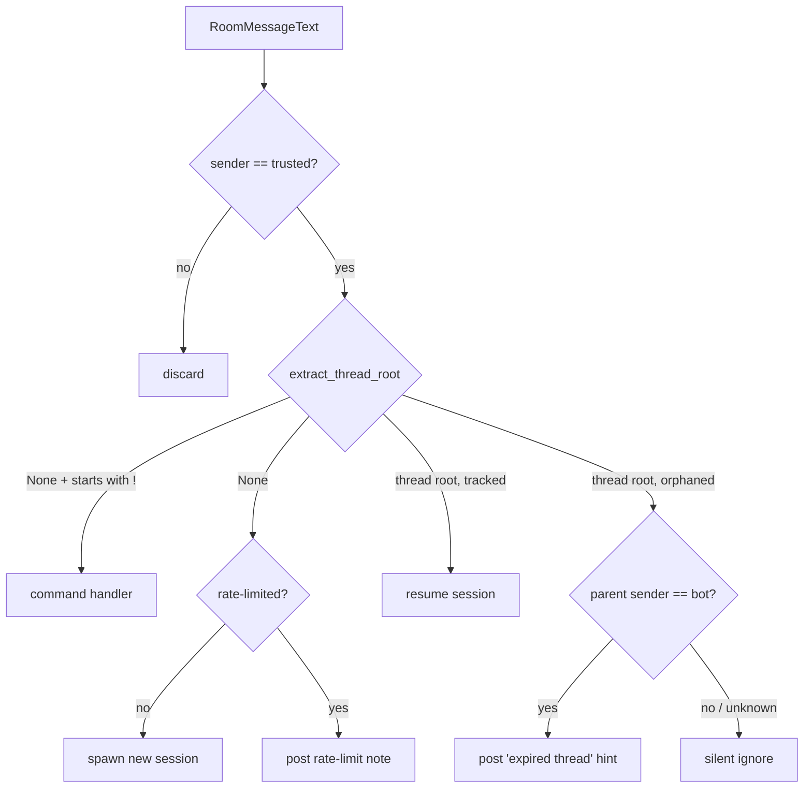

# Architecture

matrix-dispatcher is a single-process asyncio daemon. It polls Matrix `/sync`, routes
each message from a trusted sender by **thread structure** (not by AI judgment), and
spawns or resumes a `claude -p` subprocess whose stdout it posts back to the room. This
document covers the moving parts that the README summarizes: the database schema, the
poll/dispatch flow, the subprocess/env model, and the HITL resume-on-approval loop.

## Process model

`main()` builds the Matrix client, opens SQLite, then runs three concurrent tasks:

| Task | Cadence | Responsibility |
|------|---------|----------------|
| `poll_loop` | every `poll_interval_seconds` (default 5s) | `/sync`, dispatch each `RoomMessageText` as its own task |
| `cleanup_loop` | every 24h + at startup | delete sessions older than `session_retention_days` and orphaned aliases |
| `reconcile_loop` | every `RECONCILE_INTERVAL_SECONDS` (10s) | resume sessions whose HITL approval has landed (no-op if the registry is disabled) |

Each inbound message is handled in its own `asyncio.Task` so the poll loop keeps reading
`/sync` while a subprocess runs. **Per-room serialization** is provided by `_room_lock`
inside `handle_event` — two messages in the same room run one at a time, but different
rooms run concurrently. Dispatching handlers as tasks (rather than awaiting inline) is
what lets `!cancel` fire *during* a running spawn.

## Routing

`handle_event` is the core. Order of checks:

1. **Sender gate** — `event.sender != trusted_sender` → silently discard (security
   flag B). Applies to spawns, resumes, and commands alike.
2. **`extract_thread_root`** determines room-root vs. thread reply. It handles both
   spec-correct threads (`rel_type=m.thread`) and Element's `m.in_reply_to` chains, and
   rejects malformed (non-string) event IDs before they reach SQLite parameter binding.
3. **Commands** — a room-root message starting with `!` is handled in-process
   (`!help`/`!sessions`/`!recap`/`!mirror`/`!cancel`); it never spawns. The `!` prefix
   is used because Element intercepts `/`-prefixed messages client-side.
4. **Thread reply, tracked** → resume the session (`claude -p --resume <session_id>`).
5. **Thread reply, orphaned** (no tracked session for the thread root) → **never spawn**.
   Fetch the parent event's sender to choose *hint* (our own expired thread) vs.
   *silent ignore* (foreign bot). Fail-closed: any fetch error → treated as foreign.
6. **Room-root** → rate-limit check (per room), then spawn
   (`claude -p --session-id <uuid> <prompt>`).

## Database (SQLite, WAL, mode 0600)

`~/.claude/data/matrix-dispatcher/sessions.db`. All queries are parameterized (security
flag D). The connection uses `check_same_thread=False` because the single event-loop
thread owns it; this invariant must hold if the code is ever refactored to use threads.

| Table | Columns | Purpose |
|-------|---------|---------|
| `sessions` | `thread_root_id` (PK), `room_id`, `agent`, `session_id`, `created_at`, `last_used_at` | one row per spawned/mirrored session; the routing table |
| `event_aliases` | `event_id` (PK), `thread_root_id` (FK) | maps dispatcher-posted event IDs (ack, response chunks, `!sessions` list items) back to a session, so a reply to any of them resolves correctly despite Element's `m.in_reply_to` quirk |
| `poll_state` | `room_id` (PK, always `global`), `since`, `updated_at` | the Matrix `/sync` next-batch token; survives restarts so messages aren't replayed |
| `pending_approvals` | `approval_id` (PK), `thread_root_id`, `session_id`, `room_id`, `tool_name`, `created_at` | local half of HITL resume-on-approval (see below) |

Retention: `run_cleanup` deletes `sessions` older than `session_retention_days` and any
`event_aliases` whose `thread_root_id` no longer exists. `poll_state` and
`pending_approvals` are managed by their own logic. Manual run: `python dispatcher.py --cleanup`.

## Subprocess & environment model (security flag C)

Sessions are launched with `asyncio.create_subprocess_exec` (never a shell — argv is a
list, no string interpolation). `_run_claude` registers the process in
`_active_processes[room_id]` so `!cancel` and shutdown can SIGTERM it, and always
deregisters in a `finally`. On timeout the process is killed and the pipe transports are
drained.

The child's environment is **not** `os.environ`. `_minimal_env` builds an explicit
allowlist — `HOME`, `PATH`, `AGENT_ID`, `AGENT_TYPE`, `LANG`, `TERM`, `USER`, and
`CLAUDE_CONFIG_DIR` if set. It deliberately does **not** glob `CLAUDE_*`, so a
`CLAUDE_API_KEY` / `CLAUDE_CODE_OAUTH_TOKEN` in the dispatcher's environment can never
leak into an agent subprocess. The `!mirror` adoption path validates candidate session
IDs with `uuid.UUID()` before they reach `--resume` argv, so nothing starting with `-`
or otherwise unstructured can be injected.

Logs (security flag E) carry only event IDs, room IDs, session IDs, actions, and exit
codes — never message bodies.

## HITL resume-on-approval (SMCP-38)

An *availability* feature layered on top of a fail-**closed** gate (scoped-mcp's
Dragonfly OTP). It is **fail-open**: if agent-postgres is unreachable, the feature simply
doesn't fire and the operator falls back to manual retry — never a bypass. Disabled
entirely unless `AGENT_REGISTRY_DSN` is set (resolved from Vault first via a one-shot
AppRole read, then a plaintext env fallback — see `registry.py`).

Flow:

1. **Detect** — when a turn ends with an approval still `pending` in `hitl_approvals`
   (`find_pending_approval`, filtered to `state='pending'` — the duplicate-execution
   guard), a row is written to the local `pending_approvals` table and the approval is
   linked to its originating `session_id` for the audit trail.
2. **Reconcile** — `reconcile_loop` cross-checks local pending rows against
   `hitl_approvals` state. On `approved` it resumes; on `denied` it posts a note and
   drops the row; rows older than `PENDING_APPROVAL_EXPIRY_SECONDS` (600s, 2× the HITL
   timeout) are expired.
3. **Claim-then-act** — the local row is deleted *before* the resume fires, so an
   overlapping pass or a restart mid-resume can never resume the same approval twice. The
   resume nudge carries **no secret** (no OTP, no token): the agent must retry the exact
   same tool call, and the pre-approval token is bound to `(tool, args_hash)`.

`registry.py` is a small, deliberately duplicated fail-open asyncpg client (every
method no-ops when the pool is `None` and swallows DB errors) rather than a shared
installable — the dispatcher and scoped-mcp touch disjoint subsets of the frozen
migration-0001 schema.
