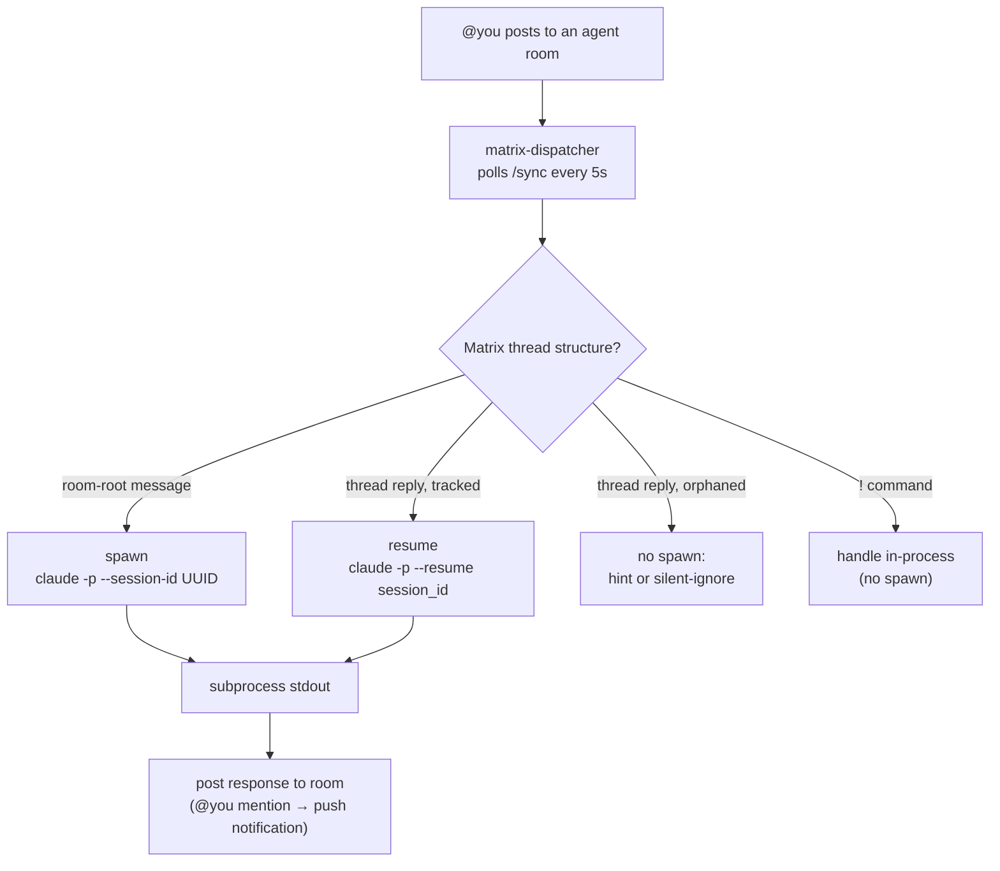
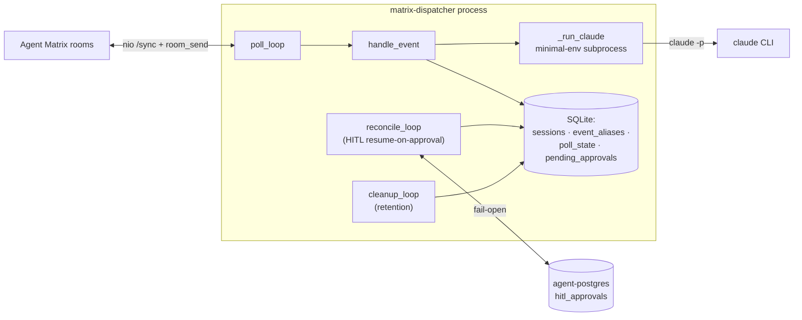

# matrix-dispatcher

[](https://claude.ai/code)
[](https://github.com/TadMSTR/matrix-dispatcher/actions/workflows/ci.yml)
[](https://www.python.org/)
[](https://opensource.org/licenses/MIT)

A PM2 daemon that watches each agent's Matrix room for messages from a trusted sender, spawns or resumes `claude -p` sessions, and posts the response back. Send a message to the room → the agent replies. Reply inside a thread → the same session resumes. Bang-prefix commands provide session management without spawning anything.

## How it works

### Data flow



### Components



**Routing discriminator:** Matrix thread structure only — room-root spawns, thread reply resumes. No timers, no AI judgment about intent.

**Orphaned replies never spawn (MDISP-6, v0.4.1).** A thread reply whose thread root has no
dispatcher-tracked session is *not* treated as a room-root message. Two cases:
- **Reply to a foreign bot's post** — agent rooms are shared with other bots that post in
  threads (scoped-mcp HITL prompts, `matrix-hitl-bot`, etc.). A reply to one of those is
  ignored silently; the dispatcher never spawns off a thread it didn't create.
- **Reply to our own expired thread** — the session behind that thread has aged out of
  tracking. The dispatcher posts a hint pointing at a fresh (non-threaded) message or
  `!sessions`, rather than silently doing nothing or spawning a disconnected session.

This is fail-closed: any error fetching the parent event is treated as foreign (no spawn).
`!mirror` is the supported way to adopt an untracked session into the routing table.

**Element reply quirk:** Element sometimes uses `m.in_reply_to` instead of the spec-correct `rel_type=m.thread`. The `event_aliases` table maps acknowledgment and response chunk event IDs back to their parent session, so a reply to any of those events still resolves to the right session.

## Commands

Commands use the `!` prefix because Element intercepts `/`-prefixed messages client-side as IRC commands (`/me`, `/join`, `/help`) and never sends them to Matrix.

| Command | What it does |
|---------|-------------|
| `!help` | List of dispatcher commands |
| `!sessions` | 10 most recent sessions in the room as numbered items; reply-in-thread to resume |
| `!recap [N]` | Last N user+assistant turns from the most recent session (default 5, cap 20). Read-only — no spawn, no resume registered |
| `!mirror` | Register the most recent untracked JSONL session in `project_dir` under a new thread root, so a CloudCLI-started session can be resumed via Matrix replies |
| `!cancel` | Send SIGTERM to the active subprocess in this room and confirm |

## Requirements

- Python 3.11+
- `claude` CLI in PATH (authenticated)
- Matrix homeserver with client API access
- One Matrix account for the dispatcher to poll and post with

## Setup

### 1. Create a venv and install deps

```bash
python3 -m venv venv
venv/bin/pip install .          # runtime only
# or, for development (linters, mypy, pytest):
venv/bin/pip install -e '.[dev]'
```

### 2. Write credentials file

Create `~/.claude-secrets/matrix-dispatcher.env` (chmod 600):

```bash
DISPATCHER_HOMESERVER=https://matrix.your-homeserver.com
DISPATCHER_USER_ID=@dispatcher-bot:your-homeserver.com
DISPATCHER_ACCESS_TOKEN=<access-token>
```

The dispatcher account needs to be a member of every agent room it watches.

### 3. Configure agents

Copy `config.example.yml` to `config.yml` and edit:

```yaml
trusted_sender: "@you:your-homeserver.com"
mention_user: "@you:your-homeserver.com"
poll_interval_seconds: 5
max_message_length: 4000
session_retention_days: 30
startup_notification_agent: research    # room to post on dispatcher launch

agents:
  research:
    room_id: "!roomid:your-homeserver.com"
    project_dir: "/home/user/.claude/projects/research"
  dev:
    room_id: "!roomid:your-homeserver.com"
    project_dir: "/home/user/.claude/projects/dev"
```

`project_dir` is the working directory passed to `claude -p` — the project's `CLAUDE.md` must be present there.

### 4. Register with PM2

```bash
pm2 start ecosystem.config.js
pm2 save
```

Logs land at `~/.pm2/logs/matrix-dispatcher-out.log` and `~/.pm2/logs/matrix-dispatcher-error.log`.

## SQLite session store

State lives at `~/.claude/data/matrix-dispatcher/sessions.db` (WAL mode). Three tables:

| Table | Purpose |
|-------|---------|
| `sessions` | One row per spawned session — `thread_root_id`, `room_id`, `agent`, `session_id`, `created_at`, `last_used_at` |
| `event_aliases` | Maps ack and response chunk event IDs back to their parent session (handles Element's `m.in_reply_to` reply format) |
| `poll_state` | Per-room Matrix sync tokens — survives restarts, no message replay |

Sessions older than `session_retention_days` (default 30) and orphaned `event_aliases` rows are deleted by `cleanup_loop()` at startup and every 24 hours. Manual cleanup: `python dispatcher.py --cleanup`.

## Security

- Only messages from `trusted_sender` are processed — all others are silently discarded. Applies to spawns, resumes, and all dispatcher commands.
- Subprocess env is a minimal allowlist (`HOME`, `PATH`, `AGENT_ID`, `AGENT_TYPE`, plus required `CLAUDE_*` vars). Dispatcher credentials do not flow into agent processes.
- Log files contain timestamps, event IDs, session IDs, room IDs, actions, and exit codes only — no message body content.
- All SQLite queries are parameterized — no f-string SQL construction anywhere in the dispatcher.
- `sessions.db` is created with mode 600.
- JSONL stems are validated with `uuid.UUID()` before being passed to `--resume` argv.
- `pyproject.toml` pins exact runtime dependency versions; CI runs `pip-audit --strict`.

## Phases

| Phase | Status | Description |
|-------|--------|-------------|
| v0.1 | shipped | Spawn-only loop, acknowledgment message, @mention, response chunking |
| v0.2 | shipped | SQLite session store, thread-based resume, `event_aliases` for Element reply quirk |
| v0.3 | shipped | `!sessions`, `!recap`, `!mirror`, `!help`; 30-day retention cleanup |
| v0.4 | shipped | Async subprocess, per-room concurrency lock, per-room rate limit, `!cancel`, startup notification |
| v0.5 | shipped | HITL resume-on-approval (SMCP-38): reconcile loop resumes a gated session once its approval lands; Vault-backed registry DSN (SMCP-42) |

See [CHANGELOG.md](CHANGELOG.md) for per-phase detail, and [ARCHITECTURE.md](ARCHITECTURE.md)
for the DB schema, dispatch flow, and subprocess/env model.

## Files

```
matrix-dispatcher/
├── dispatcher.py       # main daemon
├── agent_registry.py   # fail-open agent-postgres client (HITL resume-on-approval)
├── config.yml          # live config (not committed — contains room IDs)
├── config.example.yml  # committed template
├── pyproject.toml      # build + pinned deps + ruff/mypy/pytest/coverage config
├── ecosystem.config.js # PM2 definition (uses start.sh)
├── start.sh            # sources credentials env file, execs dispatcher
├── tests/              # pytest suite (async, ~98% coverage)
├── .github/workflows/  # CI + source-only release
└── venv/               # local venv
~/.claude/data/matrix-dispatcher/
└── sessions.db         # SQLite (sessions, event_aliases, poll_state)
~/.claude-secrets/
└── matrix-dispatcher.env   # bot credentials (chmod 600)
```

## License

MIT — see [LICENSE](LICENSE).
